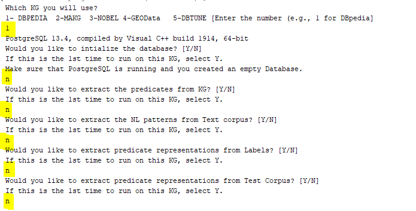
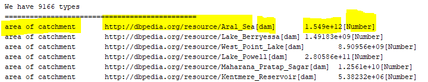
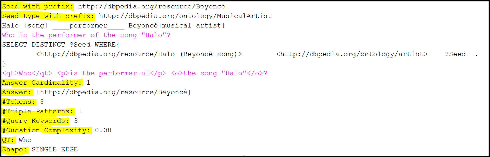

[<< Home](https://github.com/aorogat/Maestro)
# Maestro: Benchmark Generation
This document shows you how to configure Maestro to generate a new benchmark and what you expect from Maestro.
* __Run SmartBenchh.java__ 
* __Configure Maestro__ This is the first step after running Maestro. You have to configure the system as shown. Until now, Maestro supports 5 KGs, and we are working on adding more.

* The System then preprocess the seed entities that will work as the answers for the questions or a subset of the answers, and print triples examples for these entities as in the figure below.  QALD-1 has 100 questions, just 3 of them are shown.

* The System then prints the generated questions one by one. Each question consists of the natural language question, the formal query used to reterive the correct answer, the answer, and some properties about the question (e.g., number of tokens, query shapt, etc.).

* In the end, the system save the benchmark as a JSON file.


## Settings Configuration
If you would like to change the configuration, go to the ```settings``` package in the project and update the java class of the KG you target. For example, If you taget DBpedia, update ```DBpedia_Settings.java``` class. Using this class, you can update the SPARQL endpoint URL, database configuration, and more (open the class for details).
